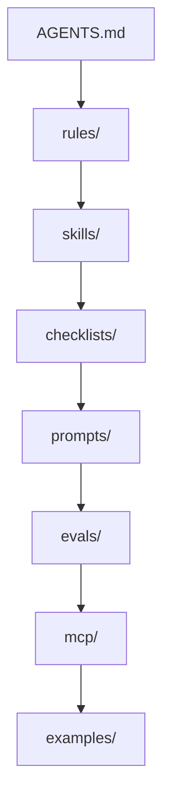

# GPT-5.4 High Operating System

Separate workspace for operating methodology around `gpt-5.4` / `gpt-5.4 high`.

This repository is intentionally separate from `Claude-cod-top-2026`.
That repo remains the Claude Code operating system.
This repo is the GPT / Codex / Responses API operating system.

## Why this exists

This repository is a disciplined operating system for `gpt-5.4` work:

- modular rules instead of one giant prompt
- evidence and verification instead of vibes
- narrow, auditable tool use instead of broad ambient access
- high autonomy inside a clear safety boundary
- explicit support for a non-professional programmer who still wants expert-level output

## Current OpenAI Baseline

As grounded in the current official docs:

- `gpt-5.4` is the default starting point for complex reasoning and coding.
- The `Responses API` is the preferred runtime for GPT-5.4 workflows.
- `gpt-5.4` supports `reasoning.effort` values `none`, `low`, `medium`, `high`, and `xhigh`.
- GPT-5.4 supports a wide hosted tool surface including web search, file search, code interpreter, shell, apply patch, computer use, MCP, and tool search.
- For harder problems, `gpt-5.4-pro` is available as the slower, deeper-thinking option.

Primary sources:

- https://developers.openai.com/api/docs/models
- https://developers.openai.com/api/docs/models/gpt-5.4
- https://developers.openai.com/api/docs/guides/latest-model

## Architecture



More detail:

- [Architecture](docs/architecture.md)
- [Audit And Verification](docs/audit-and-verification.md)
- [Work Methodology](docs/work-methodology.md)
- [Rule Precedence](docs/rule-precedence.md)
- [Assumptions Register](docs/assumptions-register.md)
- [OpenAI Source Map](docs/openai-source-map.md)

## Repository Map

| Area | Purpose |
|---|---|
| [`AGENTS.md`](AGENTS.md) | core operating profile |
| [`rules/`](rules) | evidence, safety, tools, verification |
| [`skills/`](skills) | recurring operating modes |
| [`checklists/`](checklists) | risk-based completion bars |
| [`prompts/`](prompts) | prompt blocks, composed prompts, production packs |
| [`evals/`](evals) | failure taxonomy, datasets, graders, real eval templates |
| [`mcp/`](mcp) | trust tiers, profiles, approval policy |
| [`docs/patterns/`](docs/patterns) | implementation patterns and operating modes |
| [`examples/responses/`](examples/responses) | JSON payload examples |
| [`examples/agents/`](examples/agents) | Python and JavaScript loop examples |
| [`scripts/`](scripts) | repository verification tooling |
| [`templates/`](templates) | task and eval templates |

## Canonical Sources

When guidance overlaps, use this order:

1. [`AGENTS.md`](AGENTS.md)
2. [`rules/`](rules)
3. [`checklists/`](checklists)
4. [`skills/`](skills)
5. [`prompts/production/`](prompts/production)
6. [`prompts/composed/`](prompts/composed)
7. [`prompts/blocks/`](prompts/blocks)
8. [`docs/`](docs)
9. [`examples/`](examples)

Full policy:

- [Rule Precedence](docs/rule-precedence.md)

## Quick Start

Read in this order:

1. [`AGENTS.md`](AGENTS.md)
2. [`prompts/production/sergey-autonomous-mentor.md`](prompts/production/sergey-autonomous-mentor.md)
3. [`docs/patterns/sergey-workspace-mode.md`](docs/patterns/sergey-workspace-mode.md)
4. [`mcp/approval-policy.md`](mcp/approval-policy.md)
5. [`evals/graders/real-workflows.md`](evals/graders/real-workflows.md)
6. [`evals/real/`](evals/real)

## Verify The Repo

```powershell
pwsh -File .\scripts\verify.ps1
```

Current verification covers:

- JSON examples
- JSONL eval datasets
- Python example compilation
- JavaScript syntax checks
- referenced OpenAI docs URLs
- real-eval schema coverage
- assumptions register freshness

## Recommended Prompt Packs

| Pack | Use when |
|---|---|
| [`sergey-default`](prompts/production/sergey-default.md) | general work in Sergey workspace |
| [`sergey-fast-lane`](prompts/production/sergey-fast-lane.md) | small safe-lane tasks |
| [`sergey-autonomous-mentor`](prompts/production/sergey-autonomous-mentor.md) | non-programmer operator with maximum leverage |
| [`coding-production`](prompts/production/coding-production.md) | production-facing coding agent |
| [`research-production`](prompts/production/research-production.md) | docs and current-fact verification |
| [`tool-heavy-agent-production`](prompts/production/tool-heavy-agent-production.md) | long-running or tool-heavy execution |

## What is still missing

The main gap is now empirical, not conceptual:

- more real traces
- scored eval runs over time
- scoreboards for prompt and policy changes
- richer real-world failure logs
