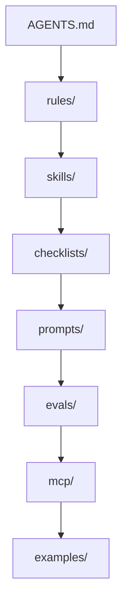

# GPT-5.4 High Operating System

Separate workspace for operating methodology around `gpt-5.4` / `gpt-5.4 high`.

This repository is intentionally separate from `Claude-cod-top-2026`.
That repo remains the Claude Code operating system.
This repo is the GPT / Codex / Responses API operating system.

## Why this exists

Most AI configs are either:

- one bloated prompt
- a pile of disconnected notes
- demo examples with no safety, no evals, and no execution discipline

This repository takes the opposite approach:

- modular rules instead of one giant instruction blob
- evidence and verification instead of vibes
- narrow, auditable tool use instead of "give the model everything"
- high autonomy inside a clear safety boundary
- strong support for a non-professional programmer who still wants expert-level output

The target experience is simple:

the agent should feel like a compact council of sharp specialists, not a chatbot improvising.

## Current OpenAI Baseline

As grounded in the current official docs:

- `gpt-5.4` is the default starting point for complex reasoning and coding.
- The `Responses API` is the preferred runtime for GPT-5.4 workflows.
- `gpt-5.4` supports `reasoning.effort` values `none`, `low`, `medium`, `high`, and `xhigh`.
- GPT-5.4 supports a wide hosted tool surface including web search, file search, code interpreter, shell, apply patch, computer use, MCP, and tool search.
- For harder problems, `gpt-5.4-pro` is available as the slower, deeper-thinking option.

Primary sources:

- https://developers.openai.com/api/docs/models
- https://developers.openai.com/api/docs/models/gpt-5.4
- https://developers.openai.com/api/docs/guides/latest-model

## Architecture



More detail:

- [Architecture](docs/architecture.md)
- [Audit And Verification](docs/audit-and-verification.md)
- [Work Methodology](docs/work-methodology.md)
- [OpenAI Source Map](docs/openai-source-map.md)

## What it is optimized for

- autonomous coding and debugging
- tool-heavy agent workflows
- current-docs verification
- safe MCP usage
- non-programmer operator support
- concise, high-signal execution

## Repository Map

| Area | Purpose |
|---|---|
| [`AGENTS.md`](AGENTS.md) | core operating profile |
| [`rules/`](rules) | evidence, safety, tools, verification |
| [`skills/`](skills) | recurring operating modes |
| [`checklists/`](checklists) | risk-based completion bars |
| [`prompts/`](prompts) | prompt blocks, composed prompts, production packs |
| [`evals/`](evals) | failure taxonomy, datasets, graders, real eval templates |
| [`mcp/`](mcp) | trust tiers, profiles, approval policy |
| [`docs/patterns/`](docs/patterns) | implementation patterns and operating modes |
| [`examples/responses/`](examples/responses) | JSON payload examples |
| [`examples/agents/`](examples/agents) | Python and JavaScript loop examples |
| [`scripts/`](scripts) | repository verification tooling |
| [`templates/`](templates) | task and eval templates |

## Signature Modes

### 1. Autonomous execution

The default posture is:

- brief context check
- execute
- verify
- report

Not:

- over-plan
- over-ask
- over-explain

### 2. Non-programmer mentor support

The operator does not need to know every hidden engineering trap in advance.
The agent is expected to:

- surface non-obvious errors
- point out material best practices
- choose robust defaults
- stay concise instead of turning into a textbook

### 3. Narrow-tool discipline

The model should not get every tool just because it can.
This repo biases toward:

- local-first
- read-only before write
- constrained MCP usage
- approval only at the real risk boundary

## Quick Start

Read in this order:

1. [`AGENTS.md`](AGENTS.md)
2. [`prompts/production/sergey-autonomous-mentor.md`](prompts/production/sergey-autonomous-mentor.md)
3. [`docs/patterns/sergey-workspace-mode.md`](docs/patterns/sergey-workspace-mode.md)
4. [`mcp/approval-policy.md`](mcp/approval-policy.md)
5. [`evals/real/`](evals/real)

## Verify The Repo

```powershell
pwsh -File .\scripts\verify.ps1
```

Current verification covers:

- JSON examples
- JSONL eval datasets
- Python example compilation
- JavaScript syntax checks
- referenced OpenAI docs URLs

## Recommended Prompt Packs

| Pack | Use when |
|---|---|
| [`sergey-default`](prompts/production/sergey-default.md) | general work in Sergey workspace |
| [`sergey-fast-lane`](prompts/production/sergey-fast-lane.md) | small safe-lane tasks |
| [`sergey-autonomous-mentor`](prompts/production/sergey-autonomous-mentor.md) | non-programmer operator with maximum leverage |
| [`coding-production`](prompts/production/coding-production.md) | production-facing coding agent |
| [`research-production`](prompts/production/research-production.md) | docs and current-fact verification |
| [`tool-heavy-agent-production`](prompts/production/tool-heavy-agent-production.md) | long-running or tool-heavy execution |

## Current Maturity

This is already a working operating system, not a placeholder.

It now includes:

- layered operating rules
- autonomous mentor mode
- MCP trust and approval profiles
- real-style eval cases
- verification automation
- end-to-end example loops
- architecture and verification docs

## Next High-Value Iterations

- add real task traces from actual daily workflows
- turn successful patterns into stronger real eval datasets
- add domain-specific packs for your most common project types
- add richer grader rubrics tied to your actual success criteria
