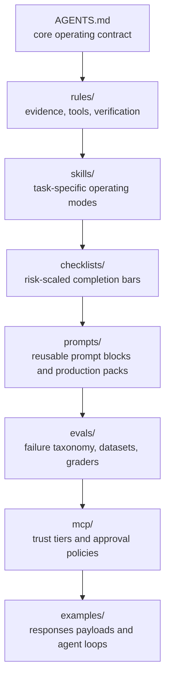
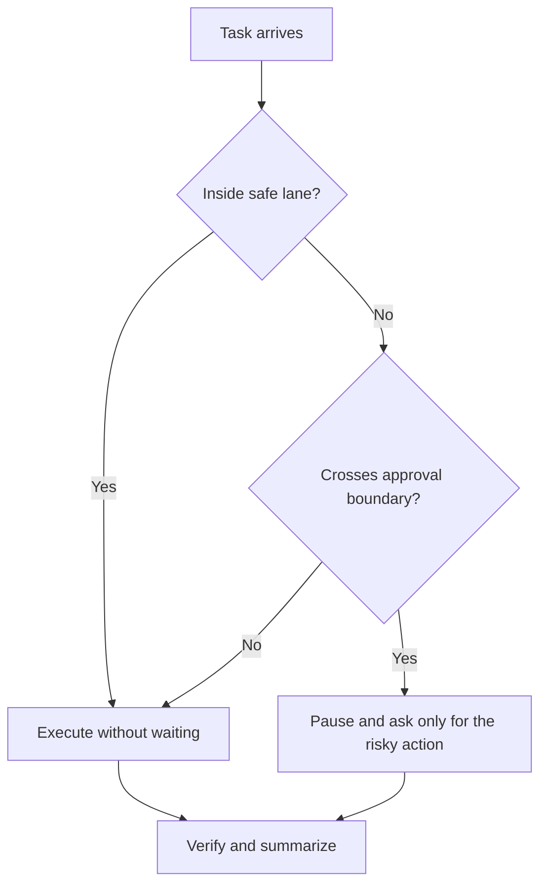

# Architecture

This repository is not a single prompt.
It is an operating system for `gpt-5.4` work.

## Layered design

## Execution philosophy

## Autonomy boundary

## Expert-council model

This repository is designed so the agent behaves like a compressed panel of specialists:

- implementer
- reviewer
- debugger
- verifier
- architect
- ops-minded operator
- documentation checker
- mentor for non-programmer workflows

But the output must remain concise and operational.

## What the layers prevent

| Layer | Main failure prevented |
|---|---|
| `AGENTS.md` | vague or inconsistent operating behavior |
| `rules/` | hallucinated claims, weak safety, under-verification |
| `skills/` | one-size-fits-all execution mode |
| `checklists/` | risk-blind completion criteria |
| `prompts/` | monolithic prompt sprawl |
| `evals/` | tuning by taste instead of evidence |
| `mcp/` | over-broad external access |
| `examples/` | abstract guidance with no execution templates |
